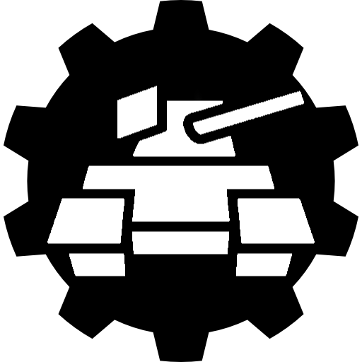

[![Contributors][contributors-shield]][contributors-url]
[![Forks][forks-shield]][forks-url]
[![Stargazers][stars-shield]][stars-url]
[![Issues][issues-shield]][issues-url]
[![Unlicense License][license-shield]][license-url]

<!-- PROJECT LOGO -->
 

  

  <h3 align="center">IronHull Engine</h3>

  

    Retro-styled 3D engine. Built in C++. Forged with raylib.
     
    <a href="https://github.com/TankTekSoftware/ironhull-engine/wiki"><strong>Explore the docs »</strong></a>
     
     
    <a href="https://github.com/TankTekSoftware/ironhull-engine">View Demo</a>
    |
    <a href="https://github.com/TankTekSoftware/ironhull-engine/issues/new?labels=bug&template=bug-report---.md">Report Bug</a>
    |
    <a href="https://github.com/TankTekSoftware/ironhull-engine/issues/new?labels=enhancement&template=feature-request---.md">Request Feature</a>
  

<!-- TABLE OF CONTENTS -->

  
Table of Contents

  <ol>
    <li>
      <a href="#about-the-project">About The Project</a>
      <ul>
        <li><a href="#built-with">Built With</a></li>
      </ul>
    </li>
    <li>
      <a href="#getting-started">Getting Started</a>
      <ul>
        <li><a href="#prerequisites">Prerequisites</a></li>
        <li><a href="#installation">Installation</a></li>
      </ul>
    </li>
    <li><a href="#usage">Usage</a></li>
    <li><a href="#roadmap">Roadmap</a></li>
    <li><a href="#contributing">Contributing</a></li>
    <li><a href="#license">License</a></li>
    <li><a href="#contact">Contact</a></li>
    <li><a href="#acknowledgments">Acknowledgments</a></li>
  </ol>

<!-- ABOUT THE PROJECT -->
## About The Project
This isn't an engine in the traditional sense. There is no editor. 

(<a href="#readme-top">back to top</a>)

### Built With
This section lists all vendors and tools IronHull was built using.

* C++ 20
* OpenGL 3.3
* [CMake](https://cmake.org/) 
* [RayLib](https://www.raylib.com/)

(<a href="#readme-top">back to top</a>)

<!-- CONTRIBUTING -->
## Contributing
Contributions are what make the open source community such an amazing place to learn, inspire, and create. Any contributions you make are **greatly appreciated**.

If you have a suggestion that would make this better, please fork the repo and create a pull request. You can also simply open an issue with the tag "enhancement".
Don't forget to give the project a star! Thanks again!

1. Fork the Project
2. Create your Feature Branch (`git checkout -b feature/AmazingFeature`)
3. Commit your Changes (`git commit -m 'Add some AmazingFeature'`)
4. Push to the Branch (`git push origin feature/AmazingFeature`)
5. Open a Pull Request

### Top contributors:

(<a href="#readme-top">back to top</a>)

<!-- LICENSE -->
## License

Distributed under the MIT License. See `LICENSE` for more information.

(<a href="#readme-top">back to top</a>)

<!-- CONTACT -->
## Contact
Michael Smith - msmith@tankteksoftware.com
Aidenn Shay - ashay@tankteksoftware.com
Zach Clawson - zclawson@tankteksoftware.com

Project Link: [https://github.com/TankTekSoftware/ironhull-engine](https://github.com/TankTekSoftware/ironhull-engine)

(<a href="#readme-top">back to top</a>)

<!-- MARKDOWN LINKS & IMAGES -->
<!-- https://www.markdownguide.org/basic-syntax/#reference-style-links -->
[contributors-shield]: https://img.shields.io/github/contributors/TankTekSoftware/ironhull-engine.svg?style=for-the-badge
[contributors-url]: https://github.com/TankTekSoftware/ironhull-engine/graphs/contributors
[forks-shield]: https://img.shields.io/github/forks/TankTekSoftware/ironhull-engine.svg?style=for-the-badge
[forks-url]: https://github.com/TankTekSoftware/ironhull-engine/network/members
[stars-shield]: https://img.shields.io/github/stars/TankTekSoftware/ironhull-engine.svg?style=for-the-badge
[stars-url]: https://github.com/TankTekSoftware/ironhull-engine/stargazers
[issues-shield]: https://img.shields.io/github/issues/TankTekSoftware/ironhull-engine.svg?style=for-the-badge
[issues-url]: https://github.com/TankTekSoftware/ironhull-engine/issues
[license-shield]: https://img.shields.io/github/license/TankTekSoftware/ironhull-engine.svg?style=for-the-badge
[license-url]: https://github.com/TankTekSoftware/ironhull-engine/blob/master/LICENSE.txt
[product-screenshot]: images/screenshot.png